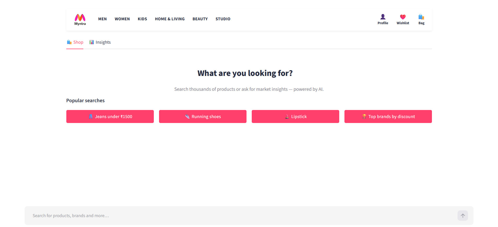
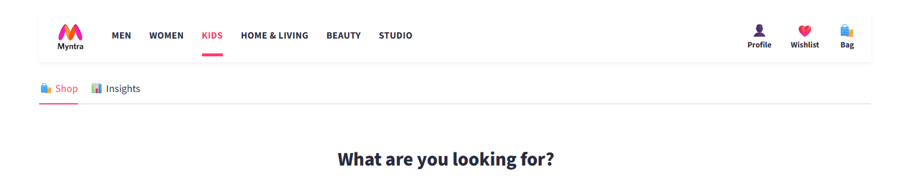

# 🛍️ Myntra Market Intelligence & AI Agent

> **Chat with your data. No dashboards. No filters. Just ask.**

An end-to-end retail-analytics platform **and** smart shopping assistant over a ~100,000-product
Myntra catalog. It combines a traditional BI foundation (Excel → Power BI) with a modern
**LLM + structured-search** pipeline — so you can either *shop* in plain English
(*"black slim-fit jeans under ₹1500"*) or ask *business questions*
(*"which brands give the highest discounts?"*) and get an answer instantly.

**Built by:** Akshay Kumar — Data Analyst | AI & Automation
**Live Demo:** https://myntra-market-intelligence.streamlit.app/
**GitHub:** [Akshay-professor](https://github.com/Akshay-professor) · **LinkedIn:** [akshay-poddar](https://www.linkedin.com/in/akshay-poddar-4299a5243/)



---

## ✨ Highlights

- **Natural-language product search** — understands item, colour, fabric, fit, gender, brand and
  budget from one sentence, and returns a Myntra-style product grid.
- **Conversational analytics** — an LLM agent answers business questions over the catalog using
  pandas tools, alongside an interactive Insights dashboard.
- **Intent-aware routing** — greetings, shopping, analytics and off-topic questions are each handled
  differently; off-topic ("who is India's PM?") is politely declined, not answered with products.
- **Accuracy-first search** — filters on *structured columns* mined from the data, not fuzzy text,
  so "black jeans" never returns black mascara.
- **Cost-conscious** — rules handle the easy cases for free; only real queries spend a small LLM
  call; the heavy model is reserved for analytics.
- **Tested & resilient** — ~66 automated tests; degrades gracefully to keyword search if the LLM API
  is down.

---

## 📸 Live Demo Screenshots

### 1. The Shopping Assistant (new Myntra-style UI)
A redesigned, Myntra-styled UI with a sticky navigation bar, product grid, and conversational search.



### 2. Intelligent Structured Search
The AI extracts constraints (budget, colour, item, brand, gender) and runs a precise, on-attribute
search — *"black cap"* returns caps, not cappuccino or capris.


### 3. Visual Dashboard & Data Insights
The **Insights** tab auto-generates charts for brand performance, category pricing, rating analysis
and discount strategy.


---

## 🎯 What problem does this solve?

Analysts spend hours building dashboards that still need manual interpretation, and most search boxes
are dumb keyword matchers. This project closes both gaps.

| Traditional approach | This project |
|---|---|
| Static dashboards | Live conversational agent |
| Manual filter navigation | Natural-language queries |
| Keyword search (returns junk) | Structured, fact-based search |
| Requires BI-tool expertise | Anyone can just ask |

---

## 🧠 Architecture & How It Works

A query is **routed**, not just thrown at a model:

```
User query
  └─ rule check (0 tokens)        greeting? analytics keyword? obvious product?
       ├─ greeting   → canned welcome
       ├─ analytics  → LangChain agent over pandas tools   (Groq Llama-3.3-70B)
       └─ otherwise → understand_query()                   (cheap Groq Llama-3.1-8B)
                        → JSON facts: {item, colour, fit, brand, gender, budget…}
                        ├─ product_search → structured_search()  → Myntra product grid
                        │                     └─ TF-IDF semantic fallback on a miss
                        └─ out_of_scope   → polite decline
```

### 1. Intelligent query routing
Instead of paying for an LLM call on every message, a multi-tier hybrid router intercepts greetings
and analytics keywords with **rules (0 tokens)**, and only spends a **fast/cheap LLM** call (Llama
3.1 8B) on genuine, ambiguous queries — where it extracts structured facts
(`intent`, `item`, `color`, `brand`, `budget`, `gender`).

### 2. The key insight — mining the `product_url` ⭐
The raw catalog has only 11 columns, and the attributes people actually shop by (type, colour,
fabric, fit, gender) live in **free text** — and the product *name* is often too short to contain
them. But every Myntra URL encodes the full structured title:

```
https://www.myntra.com/{TYPE}/{BRAND}/{rich-descriptive-slug}/{id}/buy
   e.g. .../tshirts/roadster/roadster-men-navy-blue-typography-printed-cotton-t-shirt/...
```

So the app **enriches the data once, offline** (`enrich.py`): it parses the URL path for the real
product **type**, and the slug + name for **gender, colour, material, fit and pattern**. Filtering
then becomes precise **column matching** instead of guessing on text — this is what makes the search
accurate (e.g. `product_type` coverage goes to **100%**, and the real gender split replaces the
mostly-"Unisex" guess).

### 3. Hybrid structured search
- **Taxonomy mapping** — items map to a canonical taxonomy (e.g. "sneakers"/"trainers" → `shoes`),
  with whole-word matching so "cap" never matches "cappuccino".
- **Hard filters** — type, gender, brand, price and discount are applied deterministically on the
  enriched columns.
- **Attribute AND + relaxation** — colour/fabric/fit/pattern are ANDed, then relaxed one at a time if
  nothing matches, so you always see the closest results instead of an empty page.
- **Semantic fallback (TF-IDF)** — for typos/loose phrasing, a scikit-learn char-ngram search ranks
  the right products.

### 4. LangChain agent for analytics
For analytical questions (*"top brands by discount"*) a LangChain agent decides which pandas-based
tools to run, observes the output, and synthesises the insight — grounded in computed numbers, not
hallucinated.

---

## 🛠️ Tech Stack

| Category | Technologies Used |
|---|---|
| **Frontend UI** | Streamlit, HTML/CSS (custom Myntra theme) |
| **Backend logic** | Python 3, Pandas |
| **AI orchestration** | LangChain |
| **LLMs / inference** | Groq API — Llama-3.1-8B (understanding), Llama-3.3-70B (analytics), Gemma-2-9B (fallback) |
| **Search engine** | scikit-learn (TF-IDF), regex, custom taxonomy + URL enrichment |
| **Data processing** | Microsoft Excel + Power BI (Phase 1 BI), Pandas (runtime) |
| **Testing** | pytest (~66 tests) |

---

## 📊 Data analysis behind the app

The catalog was first explored the classic BI way (Excel cleaning → pivot analysis → Power BI
dashboard with DAX measures) to understand the market before building the AI layer. The headline
findings:

| Metric | Value |
|---|---|
| 🏆 Top brand by revenue | Roadster — **8.95%** of total revenue |
| 📦 Top category by revenue | T-Shirts — **6.61%** of total revenue |
| 💰 Discount sweet spot | **50–60%** band shows strongest conversion |
| ⚠️ Concentration risk | Top 10 brands = **19.30%** of orders |
| ⭐ Rating lift | Products rated **>4.0** sell **3.19×** more |

These same questions are now answerable live inside the app — via the **Insights** tab and the
LangChain analytics agent over pandas tools — so the analysis isn't a one-off report, it's built in.

<details>
<summary>📷 Power BI & data-prep screenshots</summary>


</details>

---

## 🔍 Search-accuracy engineering (the interesting part)

The search didn't start accurate — it was rebuilt in stages, each fix locked in by a test:

1. **Keyword OR matching → mascara for "black jeans".** Fixed by requiring *all* keywords and
   matching on a structured `product_type` column.
2. **Substring matching → "cap" matched cap·puccino / cap·tain / cap·ris.** Fixed with whole-word,
   plural-tolerant matching (also fixed "men"→"women", "tshirt"→"sweatshirt").
3. **Sparse product names → missing colour/gender.** Fixed by mining the `product_url` (the key
   insight above).
4. **Brand-only queries hallucinated items** ("roadster" → watches). Fixed by detecting known brand
   names from the data and forcing a brand search.
5. **No exact match → empty page.** Fixed with graceful attribute relaxation + the TF-IDF fallback.

---

## ⚠️ Limitations (stated honestly)

- Attribute **recall** is bounded by what the title says — colour is present on ~58% of products; the
  rest don't state one, so they can't be colour-filtered. (A data limit, not a bug.)
- The dataset has **no review text** (only counts), so opinion-style Q&A isn't grounded in feedback.
- Attribute extraction is dictionary-based, so rare/misspelled terms can be missed.
- Each query is standalone — no multi-turn memory yet.

---

## 🗺️ Roadmap

- **Vector + visual search** — sentence-transformer embeddings + FAISS for true semantic matching;
  CLIP image embeddings for "find similar".
- **Multi-agent + tool-calling** — function-calling agents (shopping / analytics / stylist / deals)
  behind a router, plus an LLM re-ranker.
- **RAG + eval + guardrails** — grounded catalog Q&A, an LLM-as-judge search-quality harness, and
  prompt-injection safety.

---

## 🗂️ Repository Structure

```
Myntra-Market-Intelligence-Agent/
│
├── app.py                        # Streamlit UI — Myntra theme, Shop/Insights tabs, routing
├── agent.py                      # LangChain agent + LLM intent/fact extraction + brand override
├── classifier.py                 # Rule-based fast-path intent classifier
├── data_tools.py                 # Structured search engine + analytics tools
├── enrich.py                     # product_url → structured columns (type/gender/colour/…)
├── taxonomy.py                   # Product-type mapping, synonyms, whole-word matching
├── semantic_search.py            # TF-IDF fuzzy search fallback
├── preprocess_kaggle_data.py     # Data cleaning + enrichment pipeline
├── tests/                        # pytest suite (~66 tests)
│
├── requirements.txt
├── Myntra_PowerBI_Dashboard.pbix # Phase 1 Power BI report
├── docs/data_dictionary.md
└── Myntra_Project_Screenshots/
```

---

## 🚀 Run Locally

```bash
# 1. clone
git clone https://github.com/Akshay-professor/Myntra-Market-Intelligence.git
cd Myntra-Market-Intelligence-Agent

# 2. install
pip install -r requirements.txt

# 3. add your Groq key (free at https://console.groq.com) in a .env file:
#    GROQ_API_KEY=your_groq_api_key_here
#    GROQ_MODEL=llama-3.3-70b-versatile

# 4. run
streamlit run app.py
```

Run the tests:

```bash
pytest tests/ -q
```

---

## ☁️ Deploy on Streamlit Cloud (Free)

1. Push this repo to GitHub.
2. Go to [share.streamlit.io](https://share.streamlit.io).
3. Connect your repo → set the main file as `app.py`.
4. Add `GROQ_API_KEY` and `GROQ_MODEL` in the **Secrets** section.
5. Click **Deploy**.

---

## 📄 License

Owned and maintained by **Akshay Kumar**. Feel free to fork and build on it with attribution.
